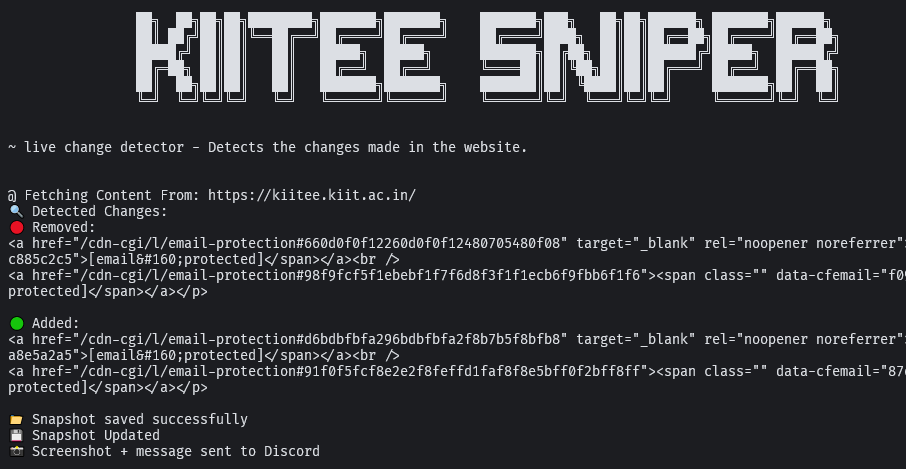
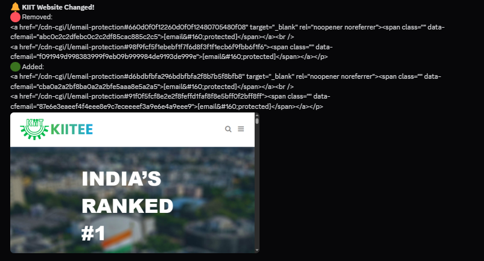

# 🎯 KIITEE Sniper

> A CLI-based website watcher for [kiitee.kiit.ac.in](https://kiitee.kiit.ac.in/) built with Rust

---

## 🔍 About

**KIITEE Sniper** is a lightweight CLI tool written in Rust that tracks changes on the [KIIT University website](https://kiitee.kiit.ac.in/).  
It fetches the HTML page, compares it with the last snapshot, and highlights **added** or **removed** content.

Perfect for students who want to keep an eye on admissions, exam schedules, or updates without reloading the site constantly.

> It is just a hobby project i built while learning rust programming language.

---

## 🖼️ Screenshot




---

## ✨ Features

- 📥 Fetches latest HTML from `https://kiitee.kiit.ac.in/`
- 🧠 Compares with previous snapshot using `difference` crate
~- 🛡️ Supports rotating proxy list from `proxies.txt`~
- 💬 Sends real-time updates to Discord via webhook
- 📸 Captures and sends a screenshot with changes (via `headless_chrome`)
- 📁 Saves and updates `kiit_snapshot.html` locally
- ⚡ CLI-based with readable diff output
- 🚫 Strips Cloudflare anti-bot scripts

---

## 🚧 Next Update

- 🔁 Add loop mode: run every X minutes
- 🔄 Retry failed proxies more intelligently
- Add Discord pings like `@everyone` or `@here` support
- More features coming
- From link -> to watch any website live detection

---

## ⚙️ Setup

### 1. Prerequisites

- 🦀 Rust → [Install Rust](https://www.rust-lang.org/tools/install)
- Set up your `.env` file:
  
```env
DISCORD_WEBHOOK=https://discord.com/api/webhooks/your_webhook_here
```
### 2. Clone & Build

```bash
git clone https://github.com/CoderZ90/KIITSniper.git
cd KIITSniper
cargo build --release
```

### 3. Folder Strucutre

```
kiit_sniper/
├── src/
│   └── main.rs
├── .env
├── proxies.txt
├── kiit_snapshot.html
├── assets/
│   └── image.png
└── Cargo.toml
```
---

## Example output

```bash
@ Fetching Content From: https://kiitee.kiit.ac.in/
🛡️ Trying Proxy: 185.23.45.10:8080
🔍 Detected Changes:

🟢 Added:
<h3>New Exam Notification Uploaded (24th June)</h3>

🔴 Removed:
<h3>Admit Card Download Link Coming Soon</h3>

💾 Snapshot Updated
📣 Discord notification sent!
```